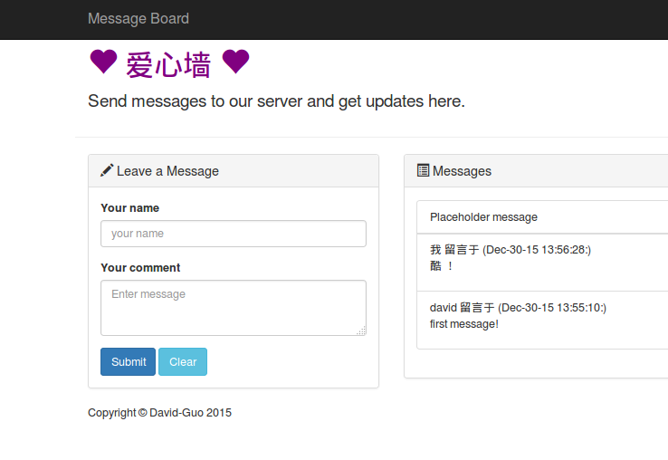

# Flask web 框架学习

学习使用Flask 框架构建简单的留言板

[开发日志](./buildlog.md)

这个应用只是一个简单的单页面留言板，使用 Python-Flask，HTML/CSS，Twitter Bootstrap ，采用响应式设计。

桌面浏览器效果如下：



手机端效果如下：

<figure class="half">
    
    
</figure>


## 环境

1. 系统：Ubuntu 14.04 64
2. 虚拟环境：virtualenv


## 安装

下载工程并开启虚拟环境

```shell
git clone https://github.com/David-Guo/build_blog
cd build_blog
``````

启动虚拟环境，安装工程依赖

```shell
$ virtualenv venv
$ source venv/bin/activate
(venv)$ pip install -r requirements.txt
``````

退出虚拟环境

```shell
(venv)$ deactivate
``````

## TODO 

* [ ] 学习Bootstrap 框架
* [ ] 学习JavaScript
