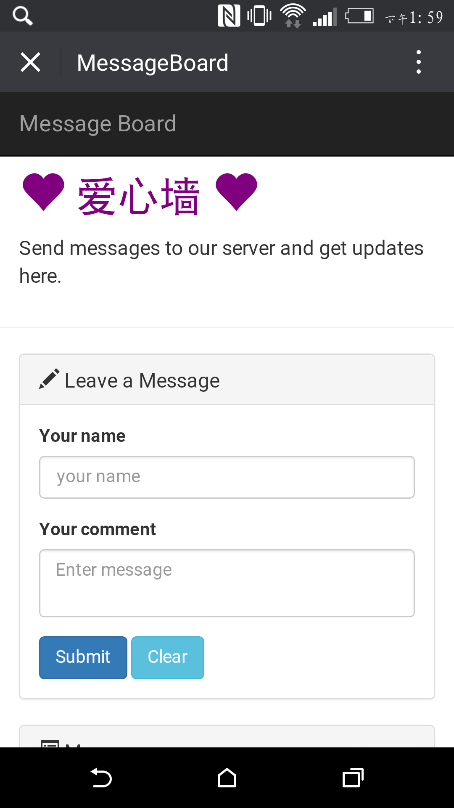
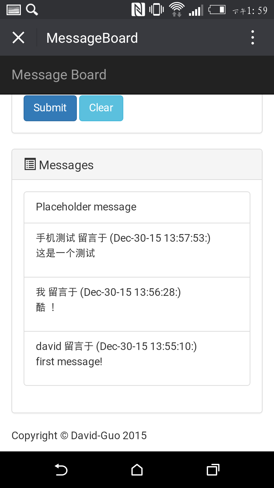

# Flask & React 留言板应用

[开发日志](./buildlog.md)

这个应用只是一个简单的单页面留言板，采用响应式设计。使用技术：

* Python-Flask
* React
* AJAX
* webpack
* Bootstrap

* frontend: 首次使用 React 结合 webpack 构建工具.
* backend: 使用 flask 框架，shelve 模块储存数据，可能是最简单的留言板，后端代码只有十几行.

## 亮点

* 响应式设计
* 前端使用 react 处理表单，AJAX 传递数据，简单易懂，全部代码只有100行
* 使用 python 内建模块 shelve 存储数据，无需安装其他数据库客户端，配置数据库
* 无需下载其他依赖，下载整个项目，开启 http server 即可在浏览器看到效果

桌面浏览器效果如下：


手机端效果如下：

<p>
<figure class="half">
    
    
</figure>
</p>

## 后端构建

启动虚拟环境，安装工程依赖，开启 http server

```shell
$ virtualenv venv
$ source venv/bin/activate
(venv)$ pip install -r requirements.txt
(venv)$ python manager.py runserver
``````

退出虚拟环境

```shell
(venv)$ deactivate
``````

## 前端构建

* 安装依赖： `cd app/static/js && npm install`
* 启动 webpack：`npm start`